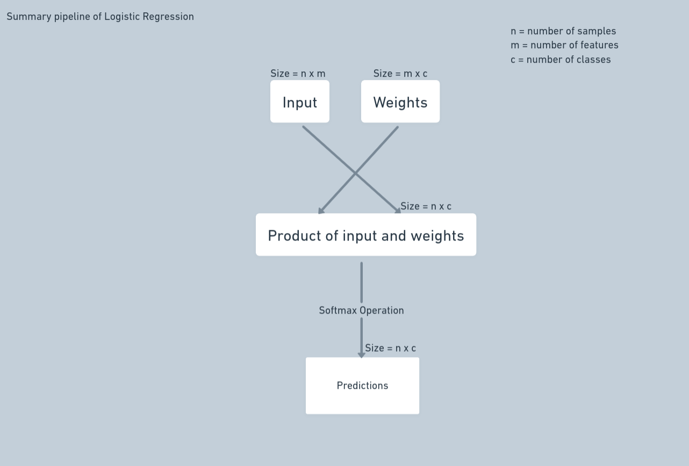

\newpage{}

# Logistic Regression

Multiclass logistic regression, also known as multinomial logistic regression or softmax regression, is a variation of logistic regression used when there are more than two possible outcomes. Unlike traditional logistic regression, which only handles binary classification, multiclass logistic regression can manage multiple classes by fitting multiple binary classifiers, one for each class, and then using these classifiers to predict the probability of each class. This is done by creating a set of one-vs-all binary classifiers, each of which is trained to distinguish one type from all the others. At prediction time, the classifier with the highest predicted probability is chosen as the output class. Multiclass logistic regression can be applied in several fields, such as image classification, natural language processing, speech recognition, and many more.

## How does it work

Multiclass logistic regression works by creating a set of binary classifiers, one for each class, and then using these classifiers to predict the probability of each class. The basic idea is to train a separate logistic regression model for each class, using the same set of independent variables, but with the outcome variable set to 1 for observations of that class and 0 for observations of all other classes.

Once the models are trained, each observation is run through each of the classifiers at prediction time, and the classifier with the highest predicted probability is chosen as the output class. The prediction is then made by computing the probability of the input belonging to each class and then selecting the class with the highest probability.

The underlying mathematical model of the multiclass logistic regression is the softmax function, which gives the probability of the input belonging to each class. It is a generalization of the logistic sigmoid function for the case of multiple classes.

## Sigmoid Function

The sigmoid function, also known as the logistic function, is a widely used mathematical function in various fields of study, such as statistics, machine learning, and artificial intelligence. It is a type of activation function used in logistic regression and other models that requires a probability output between 0 and 1. It has a strong 'S-shaped curve, which is its characteristic feature.

### Formulation of Sigmoid

$$sigmoid(x) = \frac{1}{1+e^{-x}}$$

Where:

$x$ is the input to the function

The simple nature of the sigmoid function makes it easily differentiable, and it's really efficient to implement in software and hardware. One major drawback is that it can do only binary classification. In order to support multiple classes, we use the softmax function.

The softmax function is a generalization of the sigmoid function for the case of multiple classes. It maps any input vector to a probability vector where the elements are all non-negative and sums up to 1, indicating the probability of each class.

## Softmax function

The softmax function is a generalization of the logistic sigmoid function for the case of multiple classes. It takes an input vector and returns a probability distribution over the classes. The input vector can be any real-valued vector, and the output is a probability vector that sums to 1.

The basic idea behind the softmax function is to normalize the exponential of the input vector so that the sum of all the elements in the output vector is 1. This allows the function to be used as a prediction function that assigns a probability to each class.

### Formulation of Softmax

$$p(y=i|x) = \frac{e^{W_ix}}{\sum_{j=1}^{n} e^{W_jx}}$$

Where:

$p(y=i|x)$ is the probability of the input $x$ belonging to class $i$

$W_i$ is the weight vector for class $i$

$n$ is the number of classes

$j$ is the class index

The numerator computes the dot product of the weight vector for class i and the input vector x, and the denominator is the sum of the dot product of the weight vector for all classes and the input vector x for all classes.

## Onehot Encoding

One-hot encoding is a representation of categorical variables as binary vectors. This first requires that the categorical values be mapped to integer values, that is, label encoding. Then, each integer value is represented as a binary vector that is all zero values except the index of the integer, which is marked with a 1.

The mathematical formulation for one-hot encoding for a categorical variable with n categories can be represented as follows:

$$
y = \begin{bmatrix}
y_1 \\
y_2 \\
\vdots \\
y_n \\
\end{bmatrix}
$$

Where:

$y_i$ = 1 if the input belongs to class $i$, 0 otherwise

It creates a vector with size n, which is equal to the number of categories, and in the position of the category, it assigns one, and in all other positions, it assigns 0.

For example, if there are three categories, A, B, and C, the one-hot encoded vectors would look like this:

A: [1, 0, 0]

B: [0, 1, 0]

C: [0, 0, 1]

## Loss Function - Negative Log likelihood function

Negative log-likelihood is a measure of the difference between the predicted probability distribution of the model and the true probability distribution of the data. It is calculated as the negative of the log-likelihood function. This loss function is commonly used in optimization algorithms like gradient descent to optimize the model parameters.

The negative log-likelihood is calculated by taking the negative of the logarithm of the probability of observing each class for each data point, given the model parameters. The negative log-likelihood is a measure of the dissimilarity between the predicted probability distribution and the true probability distribution. The goal is to minimize the negative log-likelihood, which will result in a predicted probability distribution that is as close as possible to the true probability distribution.

The negative log-likelihood for multiclass logistic regression can be represented as follows:

$$-\frac{1}{N}\sum_{i=1}^{N}\sum_{j=1}^{K}y_{ij} \log(p_{ij})$$

Where:

$N$ is the number of data points
$K$ is the number of classes
$y_{ij}$ is the true label for class j for data point i
$p_{ij}$ is the predicted probability of class j for data point i

## Regularization

### Overfitting

Overfitting is a problem that occurs when a model is excessively complex, such that it models the training data too well. This results in the model not being able to generalize well to new data, and it performs poorly on the test data. Overfitting is a common problem in machine learning, and it can be caused by a number of factors, such as having too many parameters, not enough training data, or noisy data.

### How Regularisation helps here

Regularisation is a technique used to prevent overfitting in machine learning models. It is a technique that adds a penalty to the loss function, which is used to train the model. The penalty is calculated based on the complexity of the model, and it is added to the loss function during training. The goal is to find a balance between the model's performance on the training data and its performance on the test data.

### L1 and L2 Regularization

L1 and L2 regularisation are two common regularisation techniques used in machine learning. They are both used to prevent overfitting in models, and they both add a penalty to the loss function. The penalty is calculated based on the complexity of the model, and it is added to the loss function during training. The goal is to find a balance between the model's performance on the training data and its performance on the test data.

In the case of multiclass logistic regression, the L1/L2 regularisation term can be added to the negative log-likelihood loss function to obtain the regularised loss function.

#### Formulation of L1 Regularization with Negative Log Likelihood

$$-\frac{1}{n}\sum_{i=1}^{n}\sum_{j=1}^{K}y_{ij} \log(p_{ij}) + \lambda \sum_{i=1}^{K} |w_i|$$

Where:

$w_i$ is the weight of the i-th feature

$\lambda$ is the regularisation parameter

#### Formulation of L2 Regularization with Negative Log Likelihood

$$-\frac{1}{n}\sum_{i=1}^{n}\sum_{j=1}^{K}y_{ij} \log(p_{ij}) + \frac{\lambda}{2} \sum_{i=1}^{K} w_i^2 $$

## Gradient Descent

Gradient Descent is an iterative optimization algorithm used commonly in the tasks of machine learning and deep learning.   Training data helps these models learn over time, and the cost function within gradient descent specifically acts as a barometer, gauging its accuracy with each iteration of parameter updates. Until the function is close to or equal to zero, the model will continue to adjust its parameters to yield the smallest possible error.

### Gradient

The gradient of a function is a vector that points in the direction of the greatest rate of increase of the function. The gradient of a function is a vector whose components are the partial derivatives of the function with respect to each of its independent variables.

With respect to the gradient descent algorithm, we progress in the opposite direction, as pointed out by the gradient, in order to achieve the lowest possible value of the cost function.

For example, in the case of a two-variable scalar-valued function, f(x,y), the gradient is a vector whose components are the partial derivatives of f with respect to x and y. The gradient is represented by the symbol $\nabla f$ or $\nabla f(x,y)$ and can be represented mathematically as:

$$\nabla f = \begin{pmatrix}\frac{\partial f}{\partial x} \\ \\ \frac{\partial f}{\partial y}\end{pmatrix} $$

### Gradient of our model (Using L2 Regularization)

$$\frac{\partial}{\partial w_i} (-\frac{1}{n}\sum_{i=1}^{n}\sum_{j=1}^{K}y_{ij} \log(p_{ij}) + \frac{\lambda}{2} \sum_{i=1}^{K} w_i^2) $$

Where:

$w_i$ is the weight of the i-th feature

$\lambda$ is the regularisation parameter

$y_{ij}$ is the true label for class j for sample i

$p_{ij}$ is the predicted probability of class j for sample i

$n$ is the number of samples

$K$ is the number of classes

Replace the regularisation term with L1 for L1 Regularization

### Gradient Descent Algorithm

Now for every iteration, we have our gradient. We subtract this gradient value from our current weights until the model hits the stopping criteria or the number of epochs (iterations).

### Learning Rate

The learning rate is a hyperparameter that controls how much we are adjusting the weights of our model with respect to the loss gradient. If the learning rate is too high, we may overshoot the optimal value. Similarly, if it is too low, we will need too many iterations to converge to the best values. Generally, the learning rate of 0.001 to 0.0001 is taken in most of the tasks. That being said, there is no best value for the learning rate parameter, and it's usually a trial-and-error process.

## Implementation Notes

The python implementation of this model is included as an ipython notebook. The following functions were defined from scratch:

* Softmax
* Loss (negative log-likelihood)
* Gradient (negative log-likelihood for L1 and L2 regularisation)
* Gradient Descent

The `Multiclass` does most of the heavy lifting, and the `fit` function is the main function that is called to train the model. The `predict` function is used to predict the class of a new sample.

Additionally, in the end, to visualize the model, we applied PCA on the iris dataset to bring down the four-dimensional data to 2 dimensions and plotted the decision boundary.

Convergence animation of the model with L1 regularisation was also rendered and can be found along with the submission.

## Results

### Implementation from scratch

We used the Iris dataset here because it has less data, thus helping us get results in lesser time. Here we got an accuracy of 97% without any improvement by using regularization. This has to do with the fact that the Iris dataset is a toy dataset meant for learning machine learning.

To show the fact that regularization can prevent overfitting, we loaded up scikit-learn's logistic regression function and tested it on the handwritten digits dataset. The results are as follows:

| Regularization | Accuracy |
|----------------|----------|
| None           | 0.958     |
| L1             | 0.972     |
| L2             | 0.975     |
